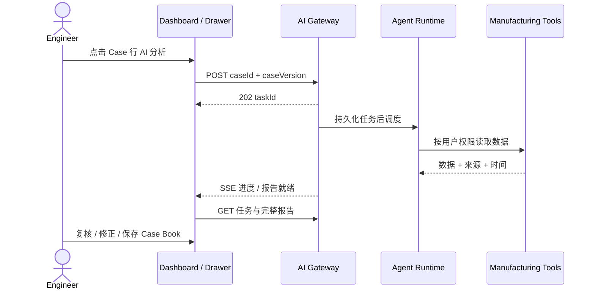

# PE Case Analysis Agent

嵌入 PE Duty / Engineer Platform Dashboard 的 **AI Case 分析功能**。
工程师在现有 Case List / Table 行末点击「AI 分析」，打开分析抽屉，查看调查进度、证据、根因假设与建议，确认或修正后归档 Case Book。

## 当前状态

2026-09-20：已实现 `mock-recorded` 纵向切片，包括 FastAPI 服务、持久化任务/事件边界、确定性合成平台适配器、录制 Jev 决策、可嵌入 Vue 分析抽屉、四种部署 profile 与 FDE 集成工具。所有演示制造数据和录制模型响应均为合成数据；尚未验证任何客户平台、IAM、制造数据源、Case Book 或生产 Jev 工作负载。

## 一次分析



## 阅读入口

| 内容 | 入口 |
|---|---|
| V1 产品基线 | [PRD-V1](docs/01-product/PRD-V1.md) |
| 用户交互 | [用户旅程](docs/01-product/user-journey.md)、[Drawer 设计](docs/06-frontend/ui-design.md) |
| 嵌入与部署 | [系统架构](docs/02-architecture/system-architecture.md) |
| Jev 接入边界 | [模型适配](docs/02-architecture/model-integration.md) |
| 调查与模型约束 | [Agent 设计](docs/03-agent/agent-design.md)、[Agent 资产](agent/README.md) |
| API / SSE | [业务 API](docs/04-api/api-spec.md)、[事件协议](docs/04-api/sse-events.md) |
| 数据契约 | [报告 Schema](agent/schemas/analysis-report.schema.json)、[数据模型](docs/05-data/data-model.md) |
| 开发与验收 | [Claude 实施计划](docs/plans/2026-09-20-mock-first-platform-integration.md)、[开发计划](docs/07-development/development-plan.md)、[验收](docs/07-development/acceptance.md) |
| 合成联调样例 | [示例说明](examples/README.md) |
| 重整说明 | [变更记录](docs/07-development/regeneration-notes.md) |

## 范围

V1：Yield Drop、单 Agent、只读工具、可恢复 SSE、结构化报告、工程师复核和 Case Book 归档。
V2：[多类型 Case 与交互调查](docs/01-product/PRD-V2.md)。V3：[审批后受控动作](docs/01-product/PRD-V3.md)。后两者是路线图。

TypeSafe Jev 已按官方文档纳入设计：它用于 Choice / Score / Noul 原子判断，由代码控制调查与组装报告。当前仓库仍未配置 API Key 或实现适配器，不声称已经接入运行环境。

## 一键合成演示

默认 profile 为 `mock-recorded`，不会调用客户平台或 live Jev。需要 Docker Compose：

```sh
docker compose --env-file deploy/profiles/mock-recorded.env -f deploy/compose.yaml -f deploy/compose.mock-recorded.yaml up --build
```

启动后打开 `http://localhost:4173`，或执行只读 smoke test：

```sh
python scripts/smoke_test.py --base-url http://localhost:8000 --case-id CASE-20260920-001
```

完整流程、失败场景和清理命令见 [演示脚本](docs/integration/demo-script.md)。生产集成前必须阅读 [已知限制](docs/integration/known-limitations.md) 和 [FDE Runbook](docs/integration/fde-runbook.md)。

## 本地开发验证

```sh
python -m pip install -r scripts/requirements.txt
python -m pip install -e "backend[dev]"
python scripts/validate_contracts.py
python -m pytest backend/tests -q
npm ci --prefix frontend
npm --prefix frontend run typecheck
npm --prefix frontend run test:unit
npm --prefix frontend run build
```

Live TypeSafe smoke 默认跳过，仅在显式设置 `RUN_TYPESAFE_LIVE=1` 和 `TYPESAFE_API_KEY` 时运行。生产 profile 缺少平台适配器配置时会启动失败，绝不回落到 mock。

## 本地资料校验

Python 3.10+，在已有 `jsonschema` 的环境运行：

```sh
python scripts/validate_contracts.py
```

缺少依赖时执行 `python -m pip install -r scripts/requirements.txt`。校验覆盖 Schema、样例、引用关系、SSE 和文档链接；不代表服务端或 UI 已通过功能测试。
