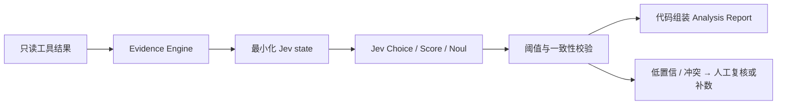

# TypeSafe Jev 集成设计

## 官方能力快照

以下信息于 2026-09-20 根据 [TypeSafe 官方文档](https://docs.typesafe.ai/)核实：Jev 是 TypeSafe 的旗舰 **System One** 模型；输入一个文本型 `state` 和多个相互独立的 typed questions，返回可由代码使用的结构化判断。

| 项目 | 官方文档所述能力 |
|---|---|
| API | `POST https://api.typesafe.ai/v1/systemone`，Bearer API Key |
| 稳定别名 | `jev-latest`；生产评估与阈值应记录响应中的实际版本 |
| 当前版本 | 文档当前列出 `jev-1.13.0`，别名以后会移动 |
| Choice | 从闭集选项中选择，返回选项、分布和 confidence |
| Score | 按有序 rubric 评分，返回分数、分布和 confidence |
| Noul | 对 yes/no 判断返回 0–1 的 yes 概率，不另含 confidence |
| 输入 | 文本，state 可为 string、JSON object 或 text array；不支持图片/音频/视频 |
| 语言 | 英语为主要训练语言；CJK 可用但准确率较低，必须用本项目数据评估 |
| 限制 | 64k 总上下文，state + 最长 question 32k；限额可能动态变化 |
| 错误 | 401、422、429、529；429/529 按 Retry-After/指数退避 |

官方文档还说明请求/响应不用于训练，并提供企业 ZDR 选项；实际生产接入仍需企业法务、数据出域和合同评审。价格、速率和别名是可变外部信息，不固化为系统保证。

## 在 PE Agent 中的角色

Jev 不生成完整报告，也不直接调用 MES/SPC/FDC。Runtime 先通过权限内工具构造有来源的 state，再向 Jev 提出窄且可评估的问题，最后由代码把判断映射为结构化报告。

适合 Jev 的判断：选择下一组调查分支、判断一条证据是否支持指定假设、对证据一致性分级、检查当前证据是否足够继续。不适合把“分析这个 Case 并写完整报告”作为一个问题，也不能把模型分数直接命名为根因概率。

`state` 使用英文键名、单位化数值、稳定 ID 与必要的中英文本。问题原子化并批量发送；每个问题独立看同一 state，因此相互依赖的多步推理由代码分阶段运行。证据 ID 必须来自 Registry，Jev 不自由生成来源标识。

## 推荐问题设计

| 用途 | Primitive | 代码行为 |
|---|---|---|
| 当前证据是否足以支持某一明确假设 | Noul | 概率仅作为信号；结合硬规则与反证决定展示等级 |
| 下一调查分支 | Choice | 选项来自允许工具组并含 `INSUFFICIENT_CONTEXT`；低 confidence 走固定工作流 |
| 证据一致性 | Score | rubric 为 INSUFFICIENT/WEAK/MIXED/STRONG；代码保留完整分布 |
| 是否存在来源不支持的断言 | Noul | 高风险时拒绝发布并人工复核 |

阈值必须由已确认历史 Case 的独立验证集校准，不能照搬官方示例。Jev confidence 表示分布集中程度，不证明答案正确；Noul 0.5 也不是“中等程度”。

## 失败与替代路径

对 429/529 做有上限且带 jitter 的重试，仍受任务总时限约束。401 不重试并告警；422 标记契约错误。TypeSafe 不可用时，V1 可继续运行确定性调查并返回 PARTIAL_RESULT，明确“模型判断不可用”；不静默切换到未经批准的外部模型。

如需自然语言解释，可由模板基于已校验字段生成。未来若增加生成式模型，它是独立适配器，只负责表达，不可改变 Jev 判断、证据关系或权限。

## 可选 OpenAI-compatible 表达层

通用 LLM 通过独立的 `ExplanationPort` 接入，仅消费已经通过 Schema 和语义校验的报告白名单视图。它使用 `PE_AGENT_EXPLANATION_PROFILE=openai_compatible` 显式启用，并从 `PE_AGENT_LLM_BASE_URL`、`PE_AGENT_LLM_MODEL`、`PE_AGENT_LLM_API_KEY` 读取配置；默认 `disabled`。

表达结果位于报告的非权威 `expression` 命名空间，不能修改 Jev 的 `modelAssessment`、证据、权限、任务状态、review/archive 字段或 canonical 报告事实。表达请求失败时保留确定性报告，不把通用 LLM 当作 Jev fallback。当前实现只支持受限的非流式 `/v1/chat/completions` 文本响应；tools、function calling、streaming 和生产默认启用均不在范围内。

该配置和 adapter 的存在不代表生产就绪。真实数据出域、供应商合同/ZDR、质量、容量、网络出口和人工评估仍需完成。

实现配置见 [model-profile.json](../../agent/model-profile.json)，问题模板见 [jev-questions.json](../../agent/jev-questions.json)。上线前通过真实账号 `GET /v1/models` 记录可用别名和响应版本。
