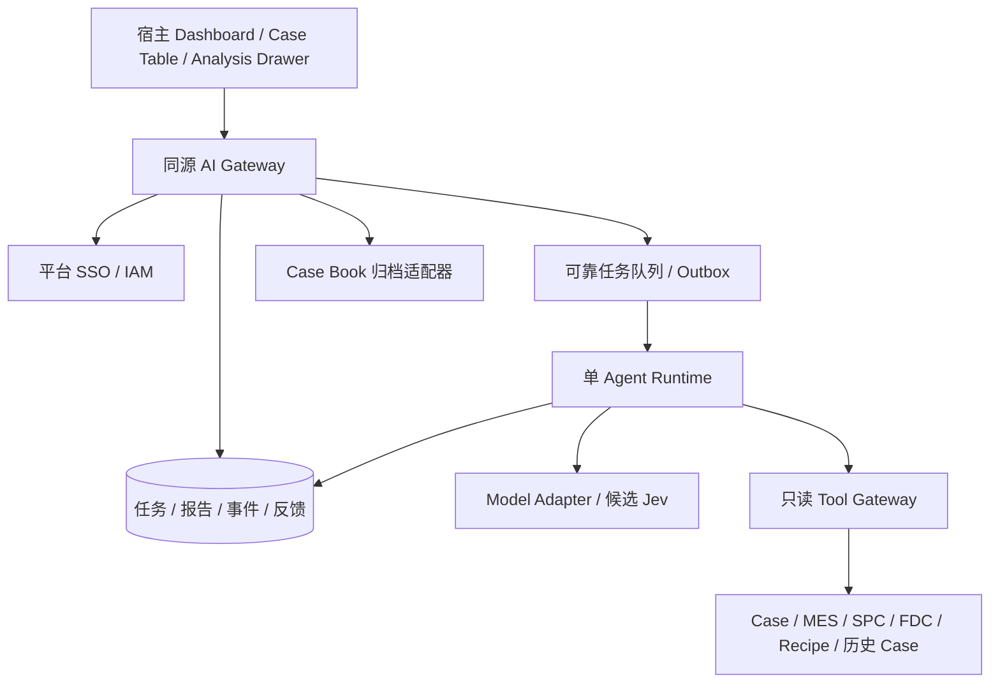

# 系统架构

## 推荐方案

现有 Dashboard 内组件 + 同源 AI Gateway/BFF + 后台单 Agent Worker。任务创建使用数据库事务和 outbox/可靠队列，SSE 只负责传输已落库事件。数据库持有任务真相，不让浏览器连接决定任务生命周期。

| 组件 | 职责 | 不承担 |
|---|---|---|
| 宿主平台 | 列表、Case 生命周期、登录、原系统导航、最终生产决策 | 模型密钥管理 |
| AI Gateway | 鉴权、幂等、任务查询、SSE、反馈、归档、配额 | LLM 内容即授权 |
| Runtime | 上下文、计划、工具调度、证据核验、报告生成 | 绕过工具读库、生产写操作 |
| Model Adapter | 协议转换、能力检测、错误归一、用量 | 业务权限或事实真伪最终判定 |
| Tool Adapter | 资源范围约束、来源、时间、单位、脱敏 | 接收任意 URL / SQL 执行 |

V1 可将 Gateway 与 Worker 放同一部署单元、不同进程，但持久化任务和事件边界不变。并发增长后独立扩容 Worker。Worker 使用租约和 fencing token；进程重启从检查点恢复，旧 Worker 不得写入新版本结果。

## 方案取舍

1. 推荐组件嵌入 + 异步服务：复用身份和 Case，上下文连贯，支持长任务恢复。
2. 独立页面/iframe：适合宿主无法修改，但增加身份传递和跨域集成；作为平台限制下的备选。
3. 按钮直接请求模型：缺少可信数据访问、任务恢复和权限边界，不满足 V1。

## 部署前置条件

明确网络出域限制、模型部署区域、IAM 委托方式、Case Book API、存储保留期、队列和数据库能力。存储设计以关系型数据库 + JSON 文档为建议，不在本轮添加未经验证的生产配置。SSE 网关关闭代理缓冲，设置心跳与合理空闲超时；浏览器不保存模型凭据。
