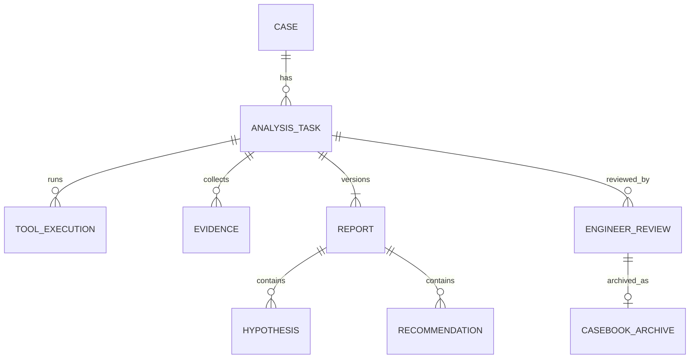

# 数据模型

Case 是外部聚合，仅保存快照引用和版本。AnalysisTask 是执行聚合；Report 是不可变版本；EngineerReview 是人工事实，不写回 Report；CaseBookArchive 记录外部归档结果。

Evidence 至少包含 evidenceId、kind、observation、sourceType/sourceId、entityRefs、eventTime、retrievedAt、quality、rawRef。模型判断单独记录 modelAssessment（questionId/version、primitive、answer/distribution、model requested/resolved、usage），不冒充 Evidence。

ID 在租户内唯一且不可预测；外部可见 ID 不暴露数据库自增键。百分比、单位、时区和未知值遵循 [领域上下文](../00-context/domain-context.md)。
